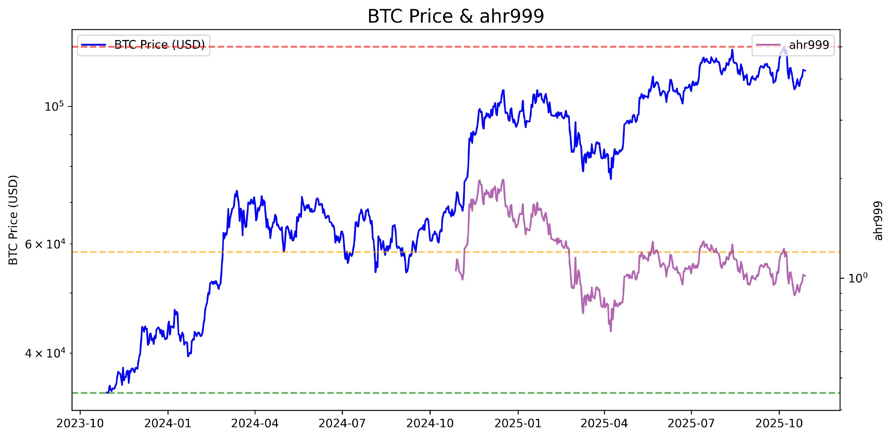
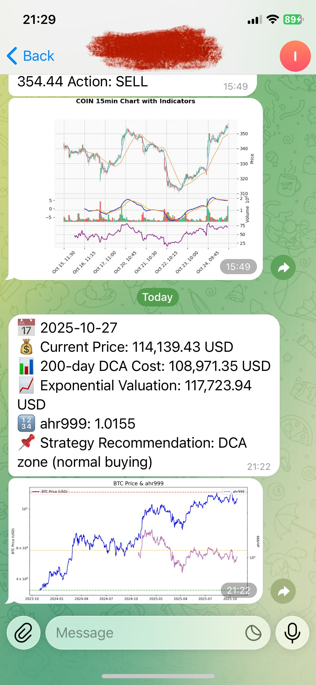

# Stock Monitor

A Python-based stock and cryptocurrency monitoring and alerting system with web dashboard, Telegram, and email notifications.
This only provides technical indicator calculation methods and is not intended as an investment reference.

## Features

- **Real-time Monitoring**: Monitors user-specified stocks and crypto tickers (via Yahoo Finance).
- **Technical Analysis**: Calculates RSI, MACD, Bollinger Bands, and generates buy/sell/hold signals.
- **Automated Alerts**: Sends notifications via Telegram and email for buy/sell signals, take profit, and stop loss events.
- **Chart Generation**: Automatically generates and saves indicator charts for each ticker.
- **Web Dashboard**: Flask-based dashboard displays latest price, indicators, signals, and recent history.
- **Persistence**: Keeps entry prices and signal history for each ticker.
- **Configurable**: Tickers are chosen by user input at runtime.
- **Docker Support**: Includes Dockerfile and docker-compose for easy deployment.
- **BTC ahr999 Model**: Includes a BTC-specific model and chart for long-term DCA strategy.

## Demo




## Project Structure

```
.
├── app.py                # Flask web dashboard
├── main.py               # Main monitoring script (multi-ticker)
├── bitcoin.py            # BTC/crypto monitoring and DCA logic
├── ahr999.py             # BTC ahr999 model and chart
├── requirements.txt      # Python dependencies
├── docker-compose.yml    # Docker Compose config
├── Dockerfile            # Docker build file
├── static/               # Generated charts and static files
├── templates/            # Flask HTML templates
├── entry_state/          # Per-ticker entry price state
├── signal_history/       # Per-ticker signal history CSVs
├── logs/                 # Log files
└── ...
```

## Usage

### 1. Install Dependencies

```bash
pip install -r requirements.txt
```

### 2. Set Environment Variables

Set the following environment variables (or edit in `docker-compose.yml`):

- `TELEGRAM_BOT_TOKEN`
- `TELEGRAM_CHAT_ID`
- `EMAIL_SENDER`
- `EMAIL_PASSWORD`
- `EMAIL_RECEIVER`

### 3. Run the Monitor

```bash
python main.py
```

You will be prompted to enter tickers (e.g. `AAPL,TSLA,BTC-USD`).

### 4. Web Dashboard

Start the Flask app:

```bash
python app.py
```

Visit [http://localhost:5000](http://localhost:5000) to view the dashboard.

### 5. Docker

To run with Docker Compose:

```bash
docker-compose up --build
```

## Customization

- **Tickers**: Enter any valid Yahoo Finance ticker symbols at runtime.
- **Intervals**: Edit `CHECK_INTERVAL` and other constants in `main.py` or `bitcoin.py`.
- **Indicators**: Modify or extend technical analysis logic as needed.

## Signal Logic

- **Buy/Sell**: Based on a scoring system using RSI, MACD, and Bollinger Bands.
- **Take Profit/Stop Loss**: Alerts and clears entry state when thresholds are hit.
- **BTC DCA**: Special logic for Bitcoin dollar-cost-averaging and ahr999 valuation.

## License

MIT License
