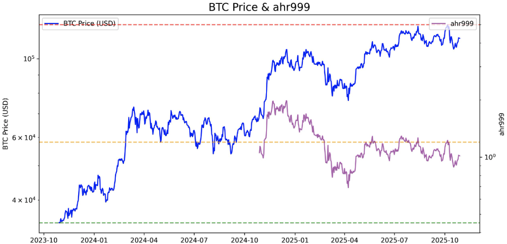
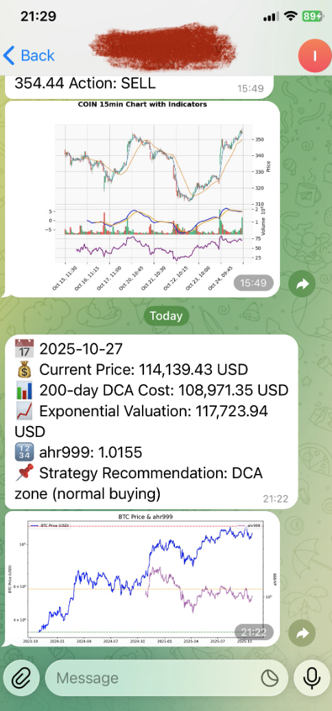

# Stock Monitor

A Python-based monitoring and alerting system for stocks and cryptocurrencies that integrates technical analysis with automated notifications via Telegram and Email. This system is designed to run as a cloud-native application, specifically optimized for AWS Lambda with S3-backed state persistence.

**Disclaimer: This project is for technical informational purposes only. It only provides technical indicator calculation methods and is not intended as an investment reference or recommendation.**

## Features

* **Multi-Ticker Tracking**: Monitors a customizable list of tickers including major stocks (e.g., AAPL, TSLA, NVDA) and cryptocurrencies (BTC-USD, ETH-USD) via Yahoo Finance.
* **Technical Analysis**: Automatically calculates key trading indicators to generate signals:
* **Relative Strength Index (RSI)**
* **Bollinger Bands (BB)**
* **Moving Average Convergence Divergence (MACD)**


* **Scoring-Based Signal Logic**: Uses a weighted scoring system based on RSI, MACD, and Bollinger Bands to trigger "BUY," "SELL," "STRONGLY BUY," or "STRONGLY SELL" actions.
* **Automated Alerts**:
* **Telegram**: Sends real-time alerts with status updates and technical charts.
* **Email**: Delivers notifications via SMTP (Gmail) including chart attachments.


* **Risk Management**:
* **Take Profit**: Automatically triggers at +5%.
* **Stop Loss**: Automatically triggers at -3%.
* **Cooldown**: 15-minute window between consecutive signals for the same ticker.


* **Cloud-Native Architecture**: Built for AWS Lambda with state persistence in Amazon S3 for tracking entry prices and signal history.
* **Visualization**: Generates 15-minute candlestick charts with 5-period and 20-period moving averages.
* **BTC ahr999 Model**: Includes a specific model and chart for Bitcoin long-term DCA strategy.

## Project Structure

* `app.py`: Core application logic containing the AWS Lambda handler, technical analysis functions, and notification dispatchers.
* `main.py`: Main monitoring script for multi-ticker tracking.
* `ahr999.py`: BTC ahr999 model and chart generation logic.
* `Dockerfile`: Configuration for building the Amazon ECR-compatible container image using the Python 3.10 Lambda base.
* `requirements.txt`: Lists essential dependencies including `yfinance`, `pandas`, `ta`, and `boto3`.

## Setup and Deployment

### 1. Environment Variables

Configure the following environment variables:

* `S3_BUCKET`: Your AWS S3 bucket for state storage.
* `TICKERS`: Comma-separated list of symbols (e.g., `AAPL,TSLA,BTC-USD`).
* `TELEGRAM_BOT_TOKEN` & `TELEGRAM_CHAT_ID`: For Telegram notifications.
* `EMAIL_SENDER`, `EMAIL_PASSWORD`, & `EMAIL_RECEIVER`: For SMTP email alerts.

### 2. Local Installation

```bash
pip install -r requirements.txt

```

### 3. Docker Build for AWS ECR

#### Build Image
```bash
docker build --platform linux/amd64 --provenance=false -t stock-monitor .
```


#### Get Login Credential

```bash
aws ecr get-login-password --region us-east-1 | docker login --username AWS --password-stdin [Account Id].dkr.ecr.us-east-1.amazonaws.com
```


#### Authenticate Docker
```bash
aws ecr create-repository --repository-name stock-monitor --region us-east-1

```

#### Tag Image
```bash
docker tag stock-monitor:latest [Account ID].dkr.ecr.us-east-1.amazonaws.com/stock-monitor:latest

```

### Push the image
```bash
docker push [Account Id].dkr.ecr.us-east-1.amazonaws.com/stock-monitor:latest

```
### Demo




## License

MIT License